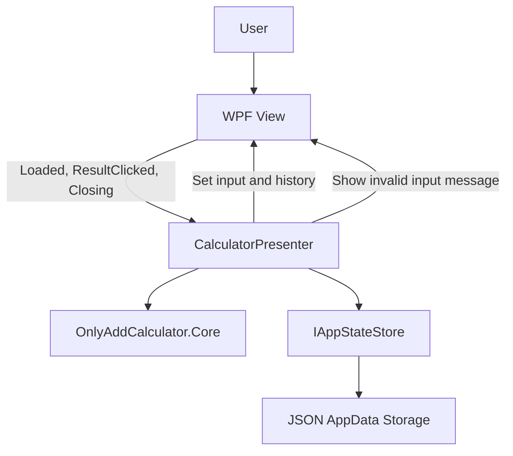

# Trap Plan

## Purpose

This document is the working architecture plan for the Only Add Calculator test assignment.
It is written for two readers:

- The developer, who should be able to review and adjust the design.
- The AI assistant, which must use this file as durable context before implementing or changing the solution.

Before making architectural or implementation changes, the AI assistant should read this document and keep the solution aligned with it unless the developer explicitly updates the plan.

## Assignment Summary

Build a Windows 11 calculator application that performs addition only.
The source of truth is `TZ_Senior_2026_.pdf`.

Required behavior:

- The application has one input field where the user may enter an expression.
- The application has a `Result` button.
- When the user clicks `Result`, the output/history area receives the result of the entered expression.
- The only supported arithmetic operation is addition.
- Valid expressions contain numbers and the `+` sign only.
- Examples of valid expressions from the specification: `54+21`, `45+00`.
- Examples of invalid expressions from the specification: `45+-88`, `98.12+48.1`.
- If the expression is invalid or the result cannot be calculated, the output/history area receives `Error`.
- If the expression is invalid, the user must also see a message asking them to check the entered information.
- After the user closes the error dialog, the input field must contain the last expression they entered.
- When the application closes, it must save the current input expression and calculation history.
- When the application opens, it must restore the saved input expression and calculation history.
- The implementation must follow Clean Architecture principles.
- The UI must use the MVP pattern.
- The application must be split into reusable modules; each module is a separate assembly.
- The implementation language is C#.
- The desktop UI framework is WPF.

## Architectural Goal

Even though the calculator is intentionally simple, the solution should demonstrate senior-level design:

- Clear module boundaries.
- Testable business logic.
- UI-independent application logic.
- Reusable assemblies that can be moved into other projects.
- Explicit contracts between layers.
- Full practical test coverage for non-UI behavior.

The solution should not become artificially complex, but it should make architectural boundaries visible and enforceable.

## Proposed Solution Structure

Expected solution layout:

```text
src/
  OnlyAddCalculator.Core/
  OnlyAddCalculator.Application/
  OnlyAddCalculator.Persistence/
  OnlyAddCalculator.Wpf/

tests/
  OnlyAddCalculator.Core.Tests/
  OnlyAddCalculator.Application.Tests/
  OnlyAddCalculator.Persistence.Tests/
  OnlyAddCalculator.Integration.Tests/
```

Optional:

- Do not add `OnlyAddCalculator.Wpf.Tests` by default.
- The WPF module is intentionally not covered with automated tests unless meaningful UI-specific logic appears.
- If the WPF project remains a thin adapter, its behavior should be covered through `Application.Tests` and manual verification against the specification screenshots.

## Project Responsibilities

Target frameworks:

- `OnlyAddCalculator.Wpf`: `net8.0-windows`
- Reusable production libraries: `net8.0`
- Test projects: `net8.0`

### OnlyAddCalculator.Core

Contains pure business logic.

Responsibilities:

- Parse the input expression.
- Validate whether the expression is a valid addition expression.
- Calculate the addition result.
- Return a structured success or failure result.
- Use `BigInteger` for integer arithmetic to avoid overflow for very large valid inputs.

Must not depend on:

- WPF.
- File system.
- JSON serialization.
- Application state storage.
- Dialogs or message boxes.
- Presenter or View abstractions.

The core module should be reusable in a console app, web app, service, or another desktop UI.

### OnlyAddCalculator.Application

Contains application workflow and MVP presenter logic.

Responsibilities:

- Define view contracts used by the presenter.
- Coordinate initialization.
- Coordinate calculation requests.
- Update history.
- Trigger invalid input notifications through the view abstraction.
- Save and load application state through persistence abstractions.
- Keep WPF-specific details out of application logic.

This project owns the main user flows, but it should not know how WPF renders controls or how persistence is physically implemented.

### OnlyAddCalculator.Persistence

Contains persistence implementations.

Responsibilities:

- Save and load the application state between sessions.
- Store current input content.
- Store operation history.
- Use a durable local storage format, likely JSON.
- Use `%AppData%\OnlyAddCalculator\` as the per-user Windows storage directory.

This project should implement storage interfaces defined by the application layer.

### OnlyAddCalculator.Wpf

Contains the Windows desktop UI.

Responsibilities:

- Define WPF windows and controls.
- Implement the view interface expected by the presenter.
- Forward user events to the presenter.
- Display input, history, and validation messages.
- Compose concrete dependencies at application startup.

The WPF project should be a thin adapter.
It should not contain parsing, calculation, history rules, or persistence policy.

### OnlyAddCalculator.Localization

Contains UI text resources.

Responsibilities:

- Store display strings in a standard .NET `.resx` resource file.
- Provide a single base `Strings.resx` resource set.
- Keep strings in English to match the specification screenshots.
- Avoid hardcoded user-facing strings in WPF code and XAML.

Only the WPF module should reference localization resources.
Core, Application, Persistence, and Presenter logic should not know about localization.

## MVP Design

The WPF window acts as the View.
The Presenter owns the screen workflow.
The Core owns calculation behavior.
Persistence stores and restores state.

Top-level View and Presenter dependency rule:

- `MainWindow` implements `ICalculatorView`.
- `CalculatorPresenter` receives `ICalculatorView` in its constructor.
- `ICalculatorView` exposes UI events such as Loaded, Result requested, and Closing.
- `CalculatorPresenter` subscribes to those View events.
- `MainWindow` does not store or reference `CalculatorPresenter`.
- `MainWindow` must not construct `CalculatorPresenter` directly.
- `MainWindow` must not call a presenter factory.
- A WPF-side `MainWindowFactory` creates both `MainWindow` and `CalculatorPresenter`.
- Creating the presenter is enough to connect the pair because the presenter subscribes to the View events.
- This creates a one-way runtime dependency: Presenter depends on View; View does not depend on Presenter.
- `OnlyAddCalculator.Application` must not reference `OnlyAddCalculator.Wpf`.



The View should expose a small interface, conceptually similar to:

```csharp
public interface ICalculatorView
{
    event EventHandler OnViewLoaded;
    event EventHandler OnResultRequested;
    event EventHandler OnViewClosing;

    string Input { get; set; }
    void SetHistory(IReadOnlyList<HistoryItemViewModel> history);
    void ShowInvalidInputMessage();
}
```

The exact names may change during implementation, but the idea should remain:

- View exposes current UI state and display operations.
- View exposes user and lifecycle events.
- Presenter calls the View through an interface.
- View raises events but does not know which object listens to them.
- Presenter does not reference WPF types.
- View does not reference the Presenter.

## Application Flow

### Startup

1. WPF starts `App`.
2. `App` creates the DI service provider through `ServiceConfiguration`.
3. `App` resolves a WPF-side `MainWindowFactory`.
4. `MainWindowFactory` creates `MainWindow`.
5. `MainWindowFactory` creates `CalculatorPresenter`, passing `MainWindow` as `ICalculatorView`.
6. `CalculatorPresenter` subscribes to `MainWindow` events through `ICalculatorView`.
7. `App` shows `MainWindow`.
8. On window load, `MainWindow` raises the `OnViewLoaded` event.
9. Presenter handles the event and initializes the screen.
10. Presenter loads saved application state from `IAppStateStore`.
11. Presenter sets saved input and history on the View.

### Calculation

1. User enters any text into the input field.
2. User clicks `Result`.
3. View raises the `OnResultRequested` event.
4. Presenter handles the event and reads `View.Input`.
5. Presenter passes the input to Core calculation logic.
6. Core returns a structured calculation result.
7. Presenter appends a history item:
   - Valid input: store and display the calculated sum.
   - Invalid input: store and display `Error`.
8. Presenter updates the View history.
9. If input is invalid, Presenter asks the View to show the invalid input message.
10. After the dialog closes, the View input must still contain the last entered expression.

### Closing

1. User closes the window.
2. View raises the `OnViewClosing` event.
3. Presenter handles the event and saves current input and current history through `IAppStateStore`.

According to the specification, application state is saved when the application closes.
Do not make "save after each calculation" the default requirement.
It can be discussed later as an optional reliability improvement, but the planned behavior should match the specification first.

## Input And Calculation Rules

Rules derived from `TZ_Senior_2026_.pdf`:

- Support addition only.
- Support non-negative integer numbers only.
- Use `BigInteger` as the numeric representation.
- Use `+` as the only operation separator.
- Accept examples such as `54+21` and `45+00`.
- Accept expressions with more than two operands, such as `55+13+45+11`.
- Accept whitespace around numbers and `+`, such as `54 + 21` or `55 + 13 + 45 + 11`.
- Leading zeroes are valid because `45+00` is explicitly listed as valid.
- Reject decimal numbers because `98.12+48.1` is explicitly listed as invalid.
- Reject negative numbers because `45+-88` is explicitly listed as invalid.
- Reject unsupported operators and any characters other than digits and `+`.
- Reject malformed expressions where the result cannot be calculated, such as empty input, `1+`, `+1`, `1++2`, or arbitrary text.
- Reject a single integer input such as `55` because no `+` operation is present.

Current interpretation:

- Decimal support is not ambiguous enough to implement: the specification gives a decimal expression as an invalid example.
- Therefore, the Core should not support fractions unless the developer explicitly changes this decision later.
- The wording "numbers and `+`" could be read broadly, but the examples narrow it to integer-only input for this assignment.
- Multiple operands are allowed because an expression like `55+13+45+11` contains only numbers and `+`, and the sum can be calculated unambiguously.
- Whitespace is allowed as a developer decision because the specification does not explicitly forbid it and the result can still be calculated unambiguously.
- A single integer is rejected as a developer decision because the assignment is specifically an addition calculator and all valid examples contain the `+` operation.

## Error Handling

Invalid input should produce two user-visible effects:

- The history entry result should be `Error`.
- The application should show a message asking the user to check the entered information.
- After the user closes the error dialog, the input field must contain the last entered expression.

The Core should not know about the message text.
The Presenter should decide that an invalid result requires a user notification.
The WPF View should display the notification, likely using `MessageBox`.
The WPF View should get the message text from `OnlyAddCalculator.Localization`.

Recommended message text:

```text
Please check the information you just entered.
```

The UI text should stay in English where the specification screenshots use English.
The exact final wording should match the screenshot from `TZ_Senior_2026_.pdf`.

Screenshot ambiguity:

- The specification references figure 5 for the error dialog.
- The main window must not be explicitly hidden while the error dialog is shown.
- Use a normal modal message box owned by the main window.
- If the screenshot shows only the dialog, treat it as an illustration of the focused modal dialog, not as a requirement to hide the main window.

## Persistence Model

The persisted state should be structured, not a pre-rendered text blob.
Store production state under:

```text
%AppData%\OnlyAddCalculator\state.json
```

Resolve `%AppData%` with:

```csharp
Environment.GetFolderPath(Environment.SpecialFolder.ApplicationData)
```

Production path construction belongs to the WPF composition root or a small WPF-side configuration component.
The JSON persistence implementation should accept an explicit file path or options object so tests can use temporary directories.
Path segment strings must be defined as constants, not repeated inline:

```csharp
private const string AppDataDirectoryName = "OnlyAddCalculator";
private const string StateFileName = "state.json";
```

Use these constants when building the production state path.

On the first launch, or when no valid state can be loaded, the application should start with:

- Empty input.
- Empty history.

If `state.json` exists but is malformed or unreadable as application state, the application must not crash.
It should fall back to empty state and allow the next normal close to overwrite the broken state file.

Application state model placement:

- Application-level state models live in `OnlyAddCalculator.Application`.
- Persistence DTOs live in `OnlyAddCalculator.Persistence`.
- Persistence maps between its DTOs and the Application state model.
- Core models should not be reused as persistence DTOs.

Persisted JSON should include a schema version:

```json
{
  "schemaVersion": 1,
  "currentInput": "54+21",
  "history": []
}
```

If a future schema change is needed, the version gives the persistence layer a clear migration or fallback decision point.

Conceptual model:

```csharp
public sealed class AppState
{
    public string CurrentInput { get; init; }
    public IReadOnlyList<HistoryItem> History { get; init; }
}
```

Conceptual history item:

```csharp
public sealed class HistoryItem
{
    public string Input { get; init; }
    public string Result { get; init; }
    public bool IsError { get; init; }
}
```

The exact model can evolve, but persistence should keep structured data.
The display string should be derived from the model, not used as the storage format.

## History Display

The specification says the output area receives the result expression and receives `Error` for invalid input.
The extracted PDF text does not provide a machine-readable exact history line format from the screenshots.

Planned display format:

```text
54+21 = 75
45+-88 = Error
```

History ordering should be verified against Appendix A screenshots during UI implementation.
If the screenshots are not decisive, prefer appending new operations after older operations, because the specification says a result is added to the output field.
New history entries should appear at the bottom.
After adding a history entry, the UI should scroll to the latest entry.

Persist history structurally, not as these display strings.
The display formatter in the WPF layer should use localization resources for `Error`.

## UI Layout

Use a minimal WPF layout that matches the assignment:

- Input `TextBox` at the top.
- `Result` button near the input.
- Operation history below the input controls.
- History area must be scrollable.

Use `ItemsControl` inside `ScrollViewer` for history rendering.

Rationale:

- History is a structured collection, not a single text blob.
- `ItemsControl` displays collections without adding selection behavior.
- `ScrollViewer` provides the required scrolling behavior.
- This avoids using a readonly `TextBox` for non-editable history.
- This avoids `ListBox` selection semantics that are not required by the assignment.

Window sizing behavior:

- Use `Grid` as the main layout container.
- Avoid absolute positioning and `Canvas`.
- Use two main rows:
  - Row 0: `Auto` height for input and button.
  - Row 1: `*` height for scrollable history.
- In the input row, use columns:
  - Column 0: `*` width for the input `TextBox`.
  - Column 1: `Auto` width for the `Result` button.
- The input `TextBox` should stretch horizontally.
- The history area should stretch horizontally and vertically.
- Set reasonable `MinWidth` and `MinHeight` on the main window.
- The `Result` button may keep a fixed or content-based width.
- The main window should not be user-resizable.
- Window size is controlled by the application.
- Disable manual resizing in WPF, for example with an appropriate `ResizeMode`.
- Width can remain fixed or application-controlled.
- Height should be application-controlled according to visible history growth behavior.
- Keep the `Result` button enabled even when the input is empty.
- Empty input should go through the normal calculation flow and produce `Error`.
- Do not add Enter-to-submit behavior unless the developer explicitly requests it later.
- Do not add history copying behavior unless the developer explicitly requests it later.
- Do not persist window size or position because the specification does not require it.
- Do not add custom theming beyond a clean minimal WPF layout.

History growth behavior:

- Match the specification screenshots: as history entries are added, the visible window/history area may grow until a defined visible history row limit is reached.
- The user should not manually resize the window; this growth is controlled by the application.
- After the visible history row limit is reached, the history area should stop growing and the vertical scrollbar should be used.
- Define the limit by number of visible history rows, not by an arbitrary pixel height.
- Store the visible history row limit in WPF resources, because it is a UI layout setting.
- Do not store this numeric layout setting in localization `.resx`; localization resources are for user-facing text.
- The implementation may convert the configured row count into a maximum history area height using the expected item height.

## Localization

Use a dedicated `OnlyAddCalculator.Localization` assembly for user-facing UI strings.

Use the standard .NET `.resx` resource mechanism:

```text
Resources/
  Strings.resx
```

Only the base `Strings.resx` file is planned for now.
Do not add culture-specific files such as `Strings.ru.resx` unless the developer explicitly decides to add another UI language later.

The base resource language is English because the specification screenshots use English UI text.

Expected resource keys:

- `AppTitle`
- `ResultButtonText`
- `InvalidInputMessage`
- `HistoryErrorResult`

Important localization rules:

- WPF may use `Strings.resx` from XAML and code-behind.
- Core must not reference localization.
- Application must not reference localization if avoidable.
- Persistence must not reference localization.
- Presenter should not pass localized strings to the View.
- Presenter should call semantic View methods such as `ShowInvalidInputMessage()`.
- The WPF View resolves localized text when rendering controls or showing dialogs.
- Persisted history should remain structured so display text such as `Error` can come from resources.

Current language selection:

- Use only the base `Strings.resx`.
- Since no culture-specific resources are planned, .NET will fall back to the base English strings on every system culture.
- Do not force `CurrentUICulture` unless a later requirement explicitly needs it.

## Testing Strategy

Use a separate test project per important production project.
This supports module reuse and keeps dependencies clean.
Use `xUnit` as the only test framework for unit and integration tests.
Use the standard `Assert` API; do not add extra assertion libraries unless there is a clear need.

Expected test packages:

- `xunit`
- `xunit.runner.visualstudio`
- `Microsoft.NET.Test.Sdk`

### Core Tests

Should cover:

- Valid specification examples: `54+21`, `45+00`.
- Multiple integer operands, such as `55+13+45+11`.
- Leading zeroes.
- Invalid specification examples: `45+-88`, `98.12+48.1`.
- Empty input.
- Unsupported operators.
- Decimal separators.
- Negative numbers.
- Malformed plus placement: `1+`, `+1`, `1++2`.
- Non-numeric text.
- Whitespace around numbers and `+`, such as `54 + 21`.

### Application Tests

Should cover Presenter behavior with fake dependencies:

- Initialization loads saved input.
- Initialization loads saved history.
- Valid calculation updates history.
- Invalid calculation adds `Error`.
- Invalid calculation asks the View to show the validation message.
- Calculation keeps the updated input and history available in the current presenter state.
- Closing saves current state.

These tests should not require WPF.

### Persistence Tests

Should cover:

- Saving state.
- Loading state.
- Preserving schema version in the JSON DTO.
- Loading when no file exists.
- Handling malformed storage by returning empty state without crashing.
- Preserving input and history across store instances.

Tests should use temporary directories or injectable file paths.

### WPF Tests

Do not add automated WPF tests by default.
The developer explicitly decided that the WPF module does not need automated tests.
If the WPF layer remains thin, manual verification against the specification screenshots plus Presenter tests should be enough for this assignment.

### Integration Tests

Add one focused integration test project:

```text
tests/
  OnlyAddCalculator.Integration.Tests/
```

Purpose:

- Verify that reusable modules work together correctly.
- Test important user flows across Application, Core, and Persistence.
- Avoid WPF UI automation and real message boxes.

Should cover:

- Presenter with real Core calculator and real JSON persistence using a temporary directory.
- Startup with empty or missing saved state.
- Startup with malformed saved state falls back to empty state.
- Valid input updates history, close saves state, next startup restores state.
- Invalid input adds an error history item, asks the View to show the invalid input message, close saves state, next startup restores state.
- Saved input is restored across simulated application sessions.
- New history entries are appended after previous entries.

Should not cover:

- XAML rendering.
- Real WPF windows.
- Mouse or keyboard automation.
- Real `MessageBox` behavior.
- Exhaustive parser validation already covered by Core unit tests.

Keep integration tests small and scenario-focused.
They should prove cross-module behavior without duplicating every unit test.

## Dependency Direction

Allowed dependency direction:

```text
OnlyAddCalculator.Wpf
  -> OnlyAddCalculator.Application
  -> OnlyAddCalculator.Core

OnlyAddCalculator.Wpf
  -> OnlyAddCalculator.Persistence

OnlyAddCalculator.Wpf
  -> OnlyAddCalculator.Localization
```

Persistence may reference Application if it implements interfaces defined there.
Core should be at the bottom and should not reference any other application project.

Preferred contract placement:

- Core calculation contracts and models stay in Core.
- Presenter and View contracts stay in Application.
- Persistence contracts can stay in Application if they are part of application workflow.
- Concrete JSON storage stays in Persistence.
- UI resource strings stay in Localization and are consumed by WPF only.

## Composition

Dependency composition should happen at the application edge, inside the WPF project.
Use `Microsoft.Extensions.DependencyInjection` for application composition.

Rationale for choosing `Microsoft.Extensions.DependencyInjection`:

- It is the official lightweight DI container from Microsoft.
- It is familiar in modern .NET applications and easy to justify in the assignment notes.
- It provides enough features for this project: constructor injection, lifetimes, and factory registrations.
- It avoids pulling in a heavier third-party container such as Autofac, Ninject, or DryIoc.
- It keeps the infrastructure simple while still removing manual object construction from WPF code-behind.

The WPF module is the composition root.
Other modules should not reference the DI container package unless there is a strong reason.

`App.xaml.cs` should remain focused on WPF lifecycle:

- Start the application.
- Create the service provider through a dedicated configuration class.
- Resolve and show the main window.
- Dispose the service provider on application exit if needed.

DI registrations should live in a dedicated WPF-side class, conceptually named `ServiceConfiguration`.
This keeps `App` thin and keeps composition concerns separate from WPF lifecycle code.

The service configuration should register:

- Core calculator/parser.
- State store.
- Main window factory.
- Presenter.

For MVP, the View and Presenter need a runtime association.
Use a dedicated WPF-side factory, conceptually named `MainWindowFactory`, to create both objects.
The factory does not attach the presenter to the View.
The presenter subscribes to View events during construction.

Conceptual startup flow:

```text
App.OnStartup()
  -> ServiceConfiguration.CreateServiceProvider()
  -> serviceProvider.GetRequiredService<MainWindowFactory>()
  -> MainWindowFactory.Create()
      -> new MainWindow()
      -> new CalculatorPresenter(view, dependencies)
  -> mainWindow.Show()
```

`MainWindowFactory` belongs to the WPF composition root.
It may depend on the services needed to construct `CalculatorPresenter`.
This keeps `MainWindow` from manually creating Core, Persistence, Application services, or presenter factories.
Keep the created presenter alive for as long as the window is alive.
The factory can do this by returning a small object that owns both the window and presenter, or by using another explicit lifetime holder.
Do not make `MainWindow` hold the presenter just to manage lifetime.
Prefer an explicit lifetime holder, conceptually named `MainWindowSession` or `MainWindowComposition`, that owns both `MainWindow` and `CalculatorPresenter`.
`App.OnStartup()` can keep that holder in a private field for the lifetime of the application.

Do not inject `IServiceProvider` into Presenter, Core, Persistence, or normal application services.
The container should be used only at the composition root.

## Implementation Principles

- Keep Core pure and deterministic.
- Keep Presenter free of WPF references.
- Keep View thin.
- Keep localization at the WPF/UI edge.
- Keep persistence replaceable.
- Prefer explicit result types over exceptions for expected validation failures.
- Use exceptions only for unexpected infrastructure failures.
- Keep models small and purposeful.
- Avoid premature abstractions that do not protect a real boundary.
- Add tests alongside each module as it is implemented.
- Use DI for composition, but do not let container usage leak outside the WPF composition root.
- Treat persistence save failures as infrastructure failures.
- Do not add user-facing save error handling unless a later requirement asks for it.
- Avoid logging infrastructure for this assignment unless it becomes necessary during implementation.

## Documentation

The assignment requires an explanatory note describing the solution.
Create a Russian-language document, for example:

```text
README.md
```

The note should explain:

- How the solution follows Clean Architecture.
- How MVP is implemented.
- Why modules are split into separate assemblies.
- How state persistence works.
- How localization is organized.
- How to run the application.
- How to run tests.
- Important decisions and interpretations of ambiguous requirements.

## Verification Commands

Primary verification command:

```text
dotnet test
```

Expected run command:

```text
dotnet run --project src/OnlyAddCalculator.Wpf
```

## AI Working Instructions

When continuing this project, the AI assistant should:

- Read this file first before implementing architectural changes.
- Preserve the MVP structure unless the developer explicitly changes the plan.
- Avoid putting business logic into WPF code-behind.
- Avoid letting Core depend on WPF, Persistence, or Application.
- Add or update tests whenever behavior changes.
- Ask before changing unresolved rules, especially input grammar and numeric format.
- Keep implementation steps small and reviewable.
- Prefer clear names over clever abstractions.

## Decisions Already Made

- Use C#.
- Use .NET 8.
- Use WPF for the Windows UI.
- Use MVP.
- Use xUnit for all unit and integration tests.
- Split business logic, application workflow, persistence, and visual layer into separate projects.
- Use separate test projects for Core, Application, and Persistence.
- Add a focused `OnlyAddCalculator.Integration.Tests` project for cross-module scenarios.
- Treat WPF as a thin adapter.
- Store history and input between sessions.
- Do not add automated WPF tests by default.
- Save application state on application close, as required by the specification.
- Store production state in `%AppData%\OnlyAddCalculator\state.json`.
- Include `schemaVersion: 1` in persisted JSON.
- Append new history entries at the bottom and scroll to the latest entry.
- Grow the visible history area until the configured visible history row limit is reached, then use scrolling.
- Store the visible history row limit in WPF resources.
- Keep `Result` enabled for empty input; empty input produces `Error`.
- Do not persist window size or position.
- Make the main window non-resizable by the user; application code controls the size.
- Do not add Enter-to-submit behavior by default.
- Do not add logging by default.
- Do not hide the main window when showing the invalid input message.
- Use `Microsoft.Extensions.DependencyInjection` for composition.
- Keep DI registration in a WPF-side `ServiceConfiguration` class.
- Keep `App.xaml.cs` thin and focused on WPF startup/shutdown lifecycle.
- Do not inject or pass `IServiceProvider` into Presenter, Core, Persistence, or normal application services.
- Use a dedicated `OnlyAddCalculator.Localization` assembly with a single base English `Strings.resx`.
- Let only the WPF module consume localization resources.
- Use `BigInteger` for calculation.
- Treat a single integer input such as `55` as invalid.
- Fall back to empty state if the saved state file is malformed.
- Keep Application state models in Application and Persistence DTOs in Persistence.
- Add a Russian explanatory note for the assignment in the root `README.md`.
